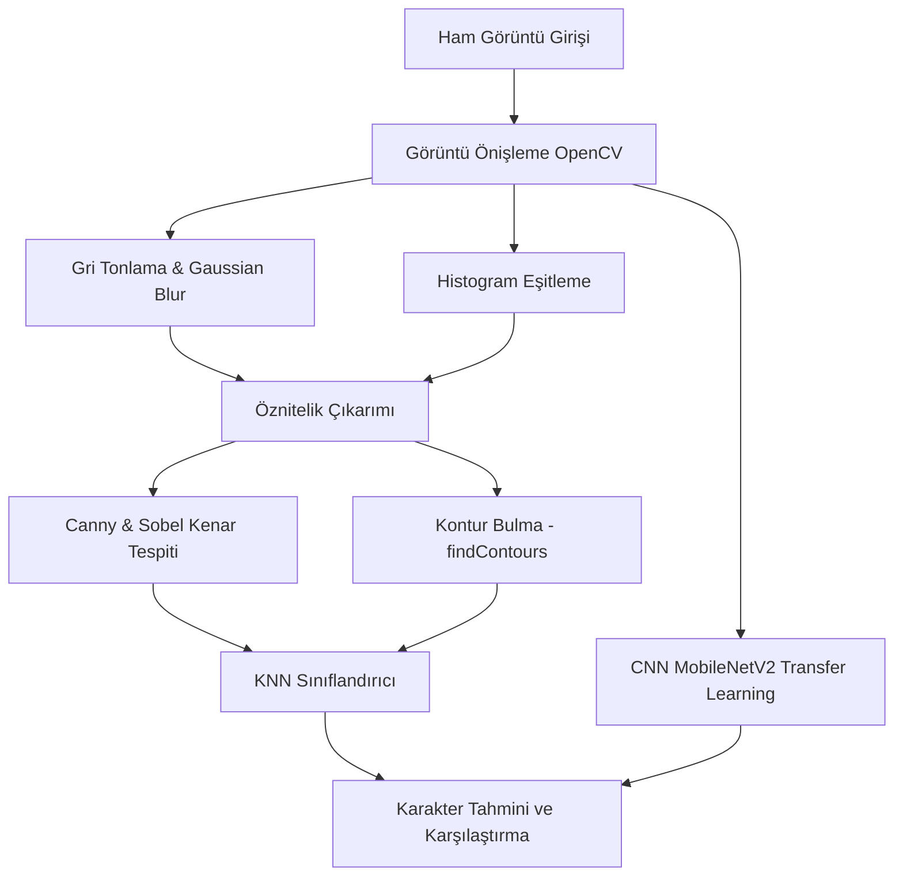

# 🎬 Friends Dizisi Karakter Tanıma ve Sınıflandırma Projesi

[](https://www.python.org/)
[](https://www.tensorflow.org/)
[](https://opencv.org/)
[](https://scikit-learn.org/)
[](LICENSE)

Bu proje; Friends dizisinin altı ana karakterini (**Rachel**, **Ross**, **Monica**, **Chandler**, **Joey**, **Phoebe**) görüntülerinden otomatik olarak tanıyabilmek için geliştirilmiş görüntü işleme tabanlı bir derin öğrenme ve makine öğrenimi sistemidir. 

Projede hem klasik makine öğrenimi yöntemleri (OpenCV öznitelik çıkarımı + KNN) hem de modern derin öğrenme yaklaşımları (MobileNetV2 ile Transfer Learning) kullanılarak karşılaştırmalı analizler sunulmuştur.

---

## 🛠️ Sistem Mimarisi & İş Akışı

Sistemin çalışma prensibi aşağıdaki aşamalardan oluşmaktadır:



---

## 📁 Proje Dosya Yapısı

Geliştirici dostu ve modüler dosya yapısı aşağıdaki şekildedir:

```text
FriendsCharClassification/
│
├── .gitignore                  # Git dışı bırakılacak dosyalar (veri seti, .keras, .pkl)
├── requirements.txt            # Proje bağımlılıkları listesi
├── README.md                   # Proje tanıtım ve kullanım kılavuzu
│
├── friendsCharClassification.ipynb # Güncellenmiş ve yerel veri yollarıyla çalışan Jupyter Notebook
│
├── src/                        # Modüler kaynak kodlar
│   ├── __init__.py
│   ├── preprocessing.py        # OpenCV görüntü işleme filtreleri ve görselleştirme araçları
│   ├── train_knn.py            # KNN modeli eğitim ve detaylı değerlendirme betiği
│   ├── train_cnn.py            # MobileNetV2 tabanlı CNN modeli eğitim betiği
│   └── predict.py              # Test sahnesi üzerinden KNN ve CNN karşılaştırmalı çıkarım CLI
│
├── docs/                       # Proje raporları ve görselleri
│   ├── technical_report.md     # Akademik formatta hazırlanmış teknik rapor (Türkçe)
│   ├── image_processing_guide.md # Adım adım görüntü işleme kod açıklamaları kılavuzu
│   └── images/                 # Eğitim eğrileri ve confusion matrix görselleri
│
└── FriendsDataSet/             # Ham veri seti klasörü (Yerel çalışır, git tarafından yoksayılır)
    ├── train/                  # Karakter bazlı alt klasörlerden oluşan eğitim verileri
    ├── test/                   # Karakter bazlı alt klasörlerden oluşan test verileri
    └── random-scene/           # Karışık sahnelerden oluşan bağımsız test görselleri
```

---

## 🖼️ Görüntü İşleme Aşamaları (OpenCV)

Modelin doğruluğunu artırmak ve görsel özellikleri belirginleştirmek amacıyla `src/preprocessing.py` modülü içinde aşağıdaki adımlar uygulanır:

1. **Gri Tonlama (Grayscale):** Görüntülerin renk kanalları tek kanala düşürülerek hesaplama maliyeti azaltılır.
2. **Gaussian Blur:** Görsel üzerindeki gürültü ve parazitler filtrelenir.
3. **Histogram Eşitleme:** Görüntünün kontrast dengesi ayarlanarak modelin yüz detaylarını daha iyi yakalaması sağlanır.
4. **Canny & Sobel Kenar Tespiti:** Yüz hatları, göz, kaş ve burun gibi karakteristik çizgilerin kenarları çıkarılır.
5. **Kontur Çıkarımı (`findContours`):** Çıkarılan kenarlar üzerinden nesne sınırları yeşil çizgilerle çizilir ve KNN için öznitelik oluşturulur.

---

## 🤖 Modelleme ve Karşılaştırmalı Sonuçlar

Projede iki farklı yaklaşım kıyaslanmıştır:

### 1. K-Nearest Neighbors (KNN)
* **Öznitelik Çıkarımı:** Görseller OpenCV filtreleri ile işlenerek Canny kenar ve kontur vektörleri çıkarılmış, ardından 64x64 boyutuna küçültülerek düzleştirilmiştir (flatten).
* **Algoritma:** K=5 komşu sayısıyla `KNeighborsClassifier` eğitilmiştir.
* **Başarı Oranı:** **%92.00 Doğruluk (Accuracy)**

### 2. Convolutional Neural Network (CNN) - Transfer Learning
* **Mimari:** Önceden ImageNet üzerinde eğitilmiş **MobileNetV2** temel alınmıştır. Modelin son 15 katmanı hariç tüm ağırlıkları dondurulmuştur. Üstüne GlobalAveragePooling, Dense katmanları ve Dropout uygulanmıştır.
* **Algoritma:** Adam optimizer ($learning\_rate=0.001$), Early Stopping ($patience=5$) ve Learning Rate Scheduler uygulanmıştır.
* **Başarı Oranı:** **%99.00 Doğruluk (Accuracy)**

| Model | Test Doğruluğu (Accuracy) | Çalışma Prensibi | Öznitelik Türü |
| :--- | :---: | :---: | :---: |
| **KNN (Makine Öğrenmesi)** | %92 | Komşuluk Analizi | El ile Tasarlanmış (Canny & Kontur) |
| **CNN (Derin Öğrenme)** | **%99** | MobileNetV2 Fine-Tuning | Derin Evrişimsel Katmanlar |

---

## 🚀 Kurulum ve Çalıştırma Kılavuzu

### 1. Gereksinimlerin Yüklenmesi
Öncelikle python ortamınızı hazırlayın ve gerekli paketleri yükleyin:
```bash
pip install -r requirements.txt
```

### 2. Veri Setinin Hazırlanması
* `FriendsDataSet.zip` dosyasını `FriendsDataSet/` klasörünün içine çıkartın.
* `random-scene.zip` dosyasını da `FriendsDataSet/random-scene` klasörüne çıkartın.
* Dizin yapısının yukarıdaki **Proje Dosya Yapısı** ile uyumlu olduğundan emin olun.

### 3. KNN Modelinin Eğitilmesi
KNN sınıflandırıcısını eğitmek, test doğruluğunu görmek ve ROC eğrilerini kaydetmek için:
```bash
python src/train_knn.py
```
*Eğitim tamamlandığında `models/knn_friends_model.pkl` dosyası otomatik olarak kaydedilecektir.*

### 4. CNN Modelinin Eğitilmesi (MobileNetV2)
Evrişimsel sinir ağını transfer öğrenimiyle eğitmek ve grafik çıktısı almak için:
```bash
python src/train_cnn.py
```
*Eğitim tamamlandığında en iyi ağırlıklara sahip model `models/cnn_friends_model.keras` olarak kaydedilecektir.*

### 5. Karşılaştırmalı Tahmin (Inference CLI)
Rastgele bir sahne görüntüsü seçerek hem KNN hem de CNN modellerinin tahminlerini görsel olarak karşılaştırmak için:
```bash
python src/predict.py
```
Belirli bir görseli test etmek isterseniz `--image` parametresini kullanabilirsiniz:
```bash
python src/predict.py --image "FriendsDataSet/random-scene/ross-geller/ross_5.png"
```

---

## 📝 Akademik Raporlar
* Detaylı teorik altyapı ve matematiksel model analizleri için [technical_report.md](file:///c:/Users/hp/Desktop/FriendsCharClassification/docs/technical_report.md) dosyasına göz atabilirsiniz.
* Adım adım OpenCV görüntü işleme algoritma açıklamaları için [image_processing_guide.md](file:///c:/Users/hp/Desktop/FriendsCharClassification/docs/image_processing_guide.md) dokümanını okuyabilirsiniz.

---

## 👥 Katkıda Bulunanlar
Bu proje; **Şifanur Özdemir** tarafından görüntü işleme ve örüntü tanıma dersi kapsamında geliştirilmiştir.
